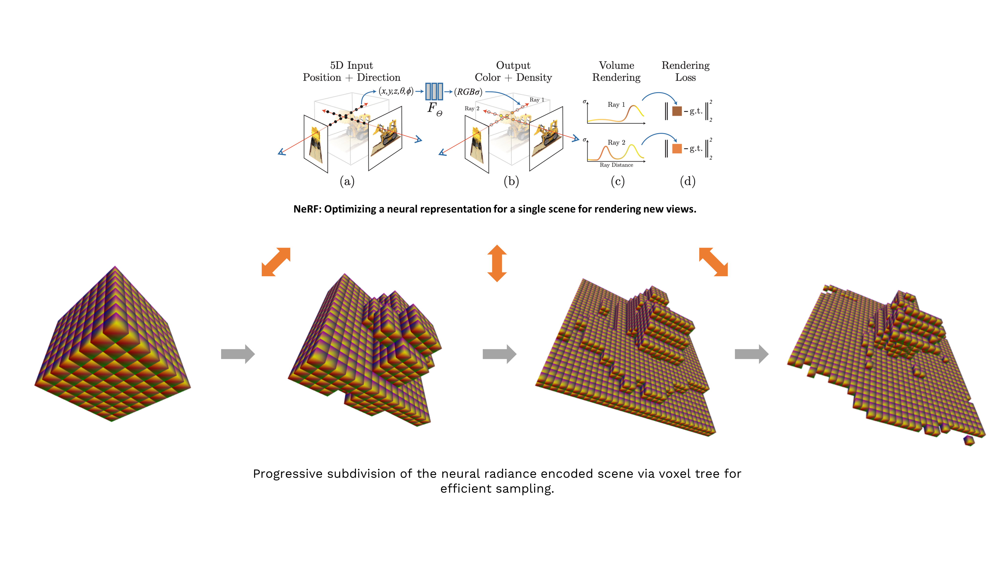

# NeRF: Neural Radiance Fields Extension

Extension of the NeRF (Neural Radiance Fields) method using PyTorch (PyTorch Lightning).


Based on the official implementation: [nerf](https://github.com/bmild/nerf)

### [Paper](https://drive.google.com/file/d/1PFV_9x3vZ2UaQjL8jXRVGoWSe0YU7IjC/view?usp=sharing) | [Data](https://drive.google.com/drive/folders/128yBriW1IG_3NJ5Rp7APSTZsJqdJdfc1)

 [Benedikt Wiberg](https://github.com/qway) <sup>1</sup> <sup>\*</sup>,
 [Cristian Chivriga](https://github.com/DomainFlag) <sup>1</sup> <sup>\*</sup>,
 [Marian Loser](https://github.com/Discusxl) <sup>1</sup>,
 [Yujiao Shentu](https://github.com/styj5) <sup>1</sup><br> <sup>1</sup>TUM <sup> <br>\*</sup>Denotes equal contribution 

## NeRF :fireworks:

NeRF (Neural radiance field) optimizes directly the parameters of continuous 5D scene representation by minimizing the error of view synthesis with the captured images given the camera poses.

## Extension of NeRF :sparkler:

<p align="center"> 
    
    <br>
    <em>Extracted Lego mesh with appearance.</em>
</p>

The project is an extension and improvement upon the original method NeRF for neural rendering view-synthesis designed for rapid prototyping and experimentation. Main improvements are: 
 - Scene encoding through unstructured radiance volumes for efficient sampling via Axis-Aligned Bounding Boxes (AABBs) intersections.
 - Mesh reconstruction with appearance through informed re-sampling based on the inverse normals of the scene geometry via Marching Cubes. 
 - Modular implementation which is 1.4x faster and at most twice as much memory efficient then the base implementation [NeRF-PyTorch](https://github.com/krrish94/nerf-pytorch).
 

## Get started

Install the dependencies via: 

### Option 1: Using pip

In a new `conda` or `virtualenv` environment, run

```bash
pip install -r requirements.txt
```

### Option 2: Using poetry

In the root folder, run

```bash
poetry install
source .venv/bin/activate
```

### Option 3: Get started on Google Colab

In the root folder, run the script considering the dataset folder is named data/ inside your Drive folder (otherwise tweak it accordingly):

```bash
. ./script.sh
```

## Data

Before getting started, if the final objective is mesh extraction, follow the [Thread](https://github.com/qway/nerfmeshes/issues/18) and find out if it's feasible based on the checklist.    

#### Synthetic dataset and LLFF

Checkout the provided data links [NeRF Original](https://github.com/bmild/nerf).

#### Your own data with [colmap](https://colmap.github.io/)
   
1. Install [COLMAP](https://github.com/colmap/colmap) following [installation guide](https://colmap.github.io/install.html).
2. Prepare your images in a folder (60-80). Make sure that auto-focus is turned off.
3. Run `python colmap_convert.py your_images_dir_path`
4. Edit the config file e.g. `config/colmap.yml` with the new generated dataset path.

## Running code :rocket:

#### Run training

Get to know the configuration files under the `src/config` and get started running your own experiments by creating new ones.

The training script can be invoked by running
```bash
python train_nerf.py --config config/lego.yml
```

To resume training from latest checkpoint:
```bash
python train_nerf.py --log-checkpoint ../pretrained/colab-lego-nerf-high-res/default/version_0/
```

#### Extracting Mesh with appearance

By the following command, you can generate mesh with high-level of detail, use `python mesh_nerf.py --help` for more options:
```bash
python mesh_nerf.py --log-checkpoint ../pretrained/colab-lego-nerf-high-res/default/version_0/ --checkpoint model_last.ckpt --save-dir ../data/meshes --limit 1.2 --res 480 --iso-level 32 --view-disparity-max-bound 1e0
```

#### See your results :star:

If `tensorboard` is properly installed, check in real-time your results on `localhost:6006` from your favorite browser:

```bash
tensorboard --logdir logs/... --port 6006
``` 

## Credits

Based on the existent work:

- [NeRF Original](https://github.com/bmild/nerf) - Original work in TensorFlow, please refer also the paper for extra information.
- [NeRF PyTorch](https://github.com/krrish94/nerf-pytorch) - PyTorch base code for the current repo.
